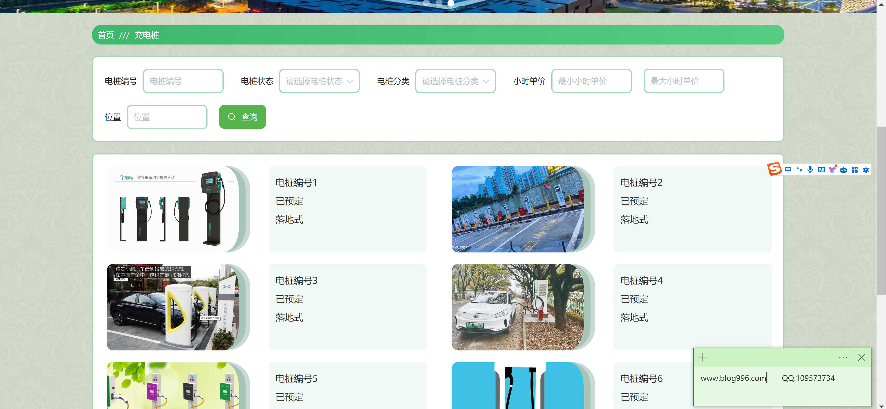
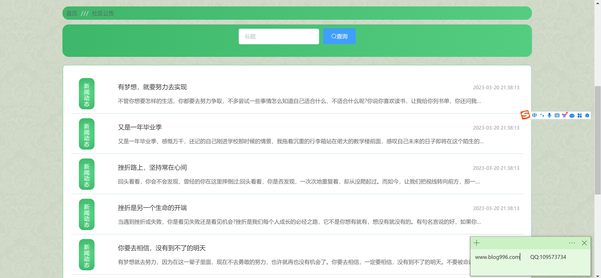
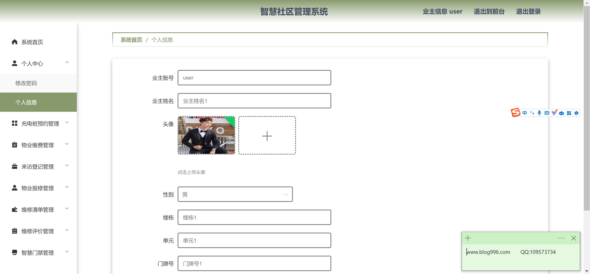
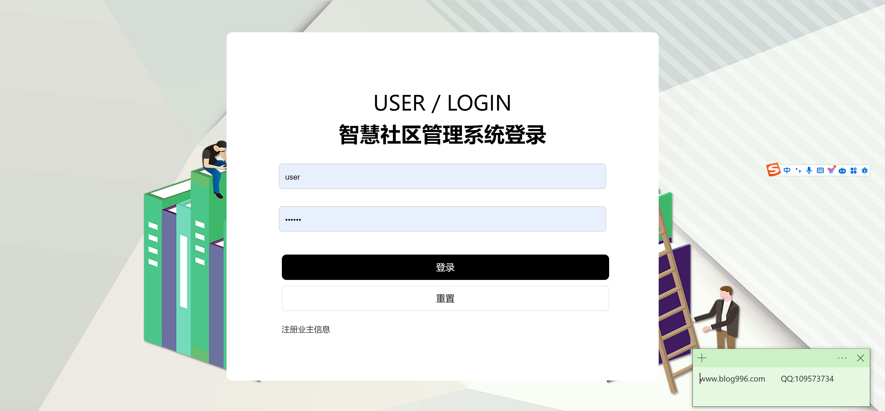
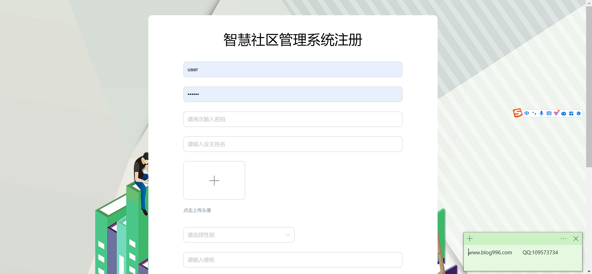
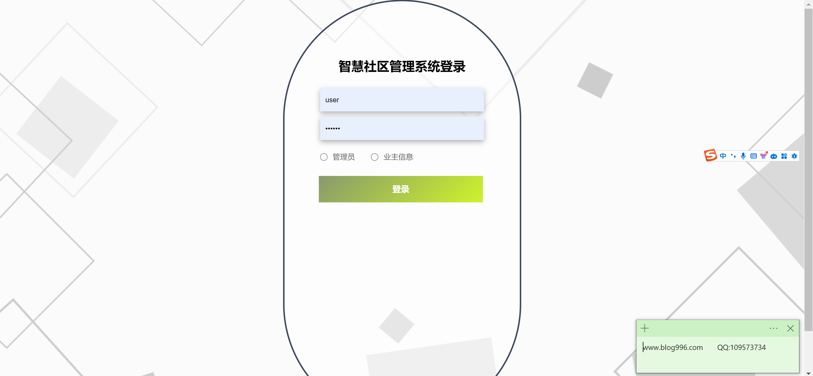
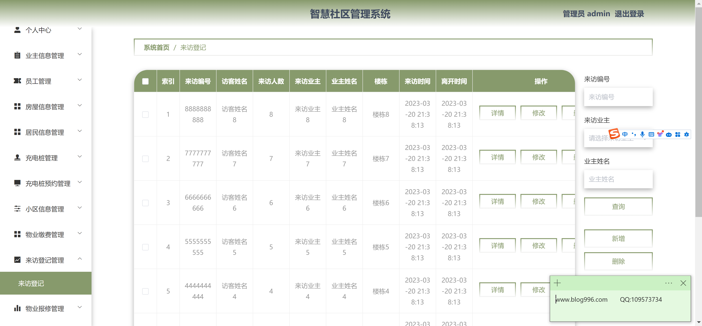

<h1 align="center">智慧社区管理系统</h1>

## 简介
智慧社区管理系统：角色分为管理员、业主；个人信息管理、充电桩预约、物业缴费、来访登记、公告发布等功能模块，提高社区管理效率和用户满意度。    --计算机毕业设计源码；毕设源码；java毕业设计源码

## 联系方式

<h3 align="center">获取完整代码与数据库文件 + 微信：bysj5151 QQ: 86050149 QQ群: 783742310</h3>

<h3 align="center">可帮忙远程部署 包运行成功！提供远程部署、修改代码、设计文档指导、代码讲解等服务！</h3>

## 功能介绍（完整见运行截图）
管理员：基本功能包括登录、注册和退出，用户信息管理涵盖业主信息、员工信息、和居民信息。提供了丰富的物业管理功能，如物业缴费、访客登记、物业报修及管理和维修信息管理。此外，管理员可以进行充电桩信息的管理与预约，以及社区整体信息的管理，以提高社区事务管理效率。

业主：可以通过登录系统访问个人中心来查看和编辑个人信息，包括个人头像、业主账号、及楼栋信息。系统提供多方面的社区服务，如充电桩预约和财务缴费。业主能够登记来访信息，方便社区管理和访客记录管理。在物业维修方面，业主可以提出报修申请并查看反馈与评价。

住户：住户信息管理支持住户对自己的信息进行查询和更新。界面设计简洁，方便住户使用，便于进行物业投诉和建议的提交。住户管理模块包括住户信息、住户公告和社区活动安排，提供快速查询和便利的操作。

访客：访客模块为来访登记提供便捷服务，包括来访人员的姓名、来访业主和楼栋信息，支持来访与离开时间的记录。访客信息通过表格方式展示，方便快速查询、修改和删除记录，确保社区管理的有序开展。

## 运行截图

本代码来源于网络,仅供学习参考使用!

